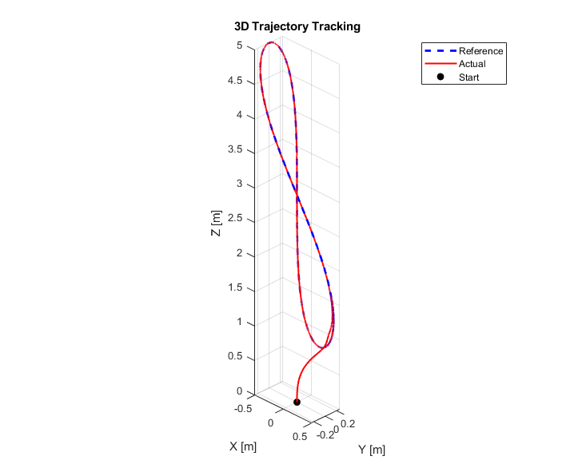
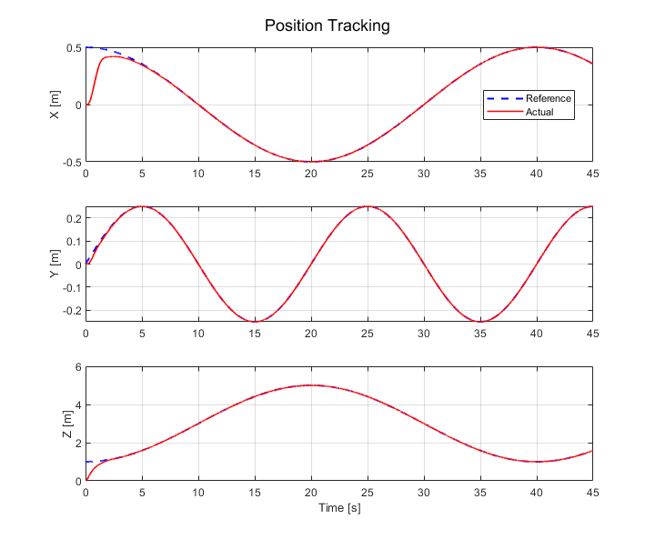
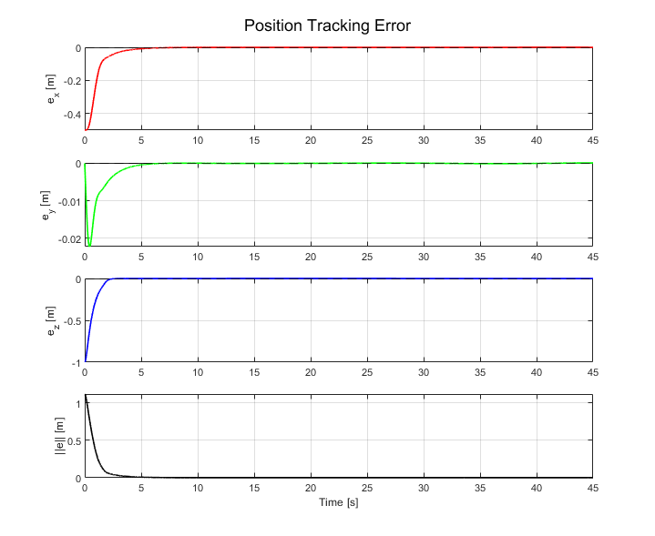

# 6DOF Quadrotor Controller: SMC Position + SMC Attitude + Differential Flatness Feedforward
**MATLAB / Simulink Implementation**

---

## Overview

Hierarchical flight controller for 6DOF quadrotor trajectory tracking,
based on the SMC architecture of Jing et al. (2022) with one key modification:
the desired angular rate and acceleration feedforward terms
(φ̇_ref, φ̈_ref, θ̇_ref, θ̈_ref) are computed **analytically via Differential Flatness**,
replacing the numerical differentiation of SMC-commanded desired angles used in the original paper.

Developed as an independent undergraduate research project at Northeastern University
(Advisor: Prof. Rifat Sipahi, 2024–2026).

---

## Modification from Baseline (Jing et al., 2022)

| | Jing et al. (2022) | This implementation |
|--|--|--|
| Position controller | SMC | SMC |
| Attitude controller | SMC | SMC |
| φ̇_ref, φ̈_ref, θ̇_ref, θ̈_ref | Numerical differentiation of desired angles | Analytically derived via Differential Flatness |

By computing feedforward terms analytically from jerk and snap of the reference trajectory,
this implementation avoids numerical differentiation errors and provides cleaner feedforward signals
during aggressive maneuvers.

---

## Controller Architecture

```
Reference Trajectory (pos, vel, acc, jerk, snap)
              ↓
   [ SMC Position Controller ]   error → desired attitude (φ_des, θ_des)
              ↓
   [ SMC Attitude Controller ]   roll / pitch / yaw torques
     + Disturbance Observer      (each axis independently)
     + DF Feedforward            (jerk/snap → φ̇_DF, φ̈_DF, θ̇_DF, θ̈_DF)
              ↓
   [ Motor Mixer ]               individual rotor commands
```

**Design rationale:**
- **SMC position controller** generates desired roll and pitch angles
  from position error via Lyapunov-proven sliding surface
- **SMC attitude controller** guarantees attitude tracking robustness
  with Lyapunov-proven stability on each axis
- **DF feedforward** provides analytically computed angular rate and acceleration references,
  replacing numerical differentiation to reduce feedforward noise during aggressive maneuvers

---

## Relationship to Other Repositories

This repository is part of a two-stage controller study:

| Stage | Repository | Modification |
|-------|------------|--------------|
| 1 | **This repo** — SMC + SMC + DF | DF feedforward introduced into SMC baseline |
| 2 | [INDI + SMC + DF](https://github.com/HojunKim00920/6DOF-quadrotor-INDI-SMC-controller) | Position loop replaced with INDI outer loop |

The progression from Stage 1 to Stage 2 isolates the effect of replacing the SMC position
controller with INDI, while keeping the DF feedforward structure consistent across both.

---

## How to Use

### Requirements
- MATLAB (tested on R2024b)
- Simulink
- Symbolic Math Toolbox (for trajectory generation)

### Workflow Overview

```
1. Parameter_SMC.m          → Initialize gains and physical parameters
2. traj_generator.m     → Generate C4 reference trajectory function files
3. SMC_POS_SMC_Att.slx  → Configure solver/timestep, run simulation
4. (Simulink Scope)     → Real-time visualization during simulation
5. excel_export_SMC.m       → Export simulation data to Excel
6. ref_traj_plotter.m   → Visualize reference trajectory from Excel
7. result_plotter.m     → Compare actual vs reference (position, velocity, acceleration)
```

---

### Step 1 — Initialize Parameters

Run `Parameter_SMC.m` to load all gains and physical parameters into the
MATLAB workspace before opening the Simulink model.

```matlab
run('Parameter_SMC.m')
```

Key parameters defined here:

| Variable | Value | Description |
|----------|-------|-------------|
| `m` | 0.8 | Mass [kg] |
| `l` | 0.165 | Arm length [m] |
| `Jx`, `Jy`, `Jz` | 0.005, 0.005, 0.009 | Moments of inertia [kg·m²] |
| `g` | 9.8067 | Gravitational acceleration [m/s²] |
| `K1` | 0.01 | Linear drag coefficient [N/(m/s)] |
| `K2` | 0 | Quadratic drag coefficient (ignored) |
| `Tmax` | 4 | Maximum thrust per rotor [N] |
| `Qmax` | 0.05 | Maximum reaction torque per rotor [N·m] |
| `Pmax`, `Pmin` | 2000, 1000 | PWM command range [μs] |
| `a1`, `a2`, `k2`... | — | SMC position/altitude gains (PSO-tuned) |
| `a3`, `k5`, `k6` | 8.191, 0.0388, 0.0219 | SMC roll/pitch: pole, switching gain, damping gain |
| `a4`, `k7`, `k8` | 2.764, 0.3147, 0.1244 | SMC yaw: pole, switching gain, damping gain |

### Step 2 — Define Reference Trajectory

Open `traj_generator.m` and define your trajectory symbolically.

```matlab
syms t real
s = t * pi / 20;

x   = 0.5 * cos(s);
y   = 0.5 * sin(s) * cos(s);
z   = 3 - 2 * cos(s);
psi = t * 0;   % Must be a function of t to avoid dimension mismatch
               % Use t*0 for constant yaw = 0
```

Any **C⁴ (four-times continuously differentiable)** trajectory
expressible as a symbolic function of `t` can be used.
The script automatically computes derivatives up to snap (4th order) and
saves them as MATLAB function files (`ref_pos.m`, `ref_vel.m`, `ref_jerk.m`, `ref_snap.m`).

Run the script:
```matlab
run('traj_generator.m')
```

### Step 3 — Run Simulation

Open and run the Simulink model:

```matlab
open('SMC_POS_SMC_Att.slx')
```

Configure in Simulink before running:
- **Solver**: fixed-step (default: `ode4`)
- **Step size**: desired step size (default: `0.001` s)
- **Stop time**: desired simulation duration

### Step 4 — Export Data

```matlab
run('excel_export_SMC.m')
```

Exports position, velocity, and acceleration (actual + reference) to `simulation_result_data.xlsx`.

### Step 5 — Visualize Results

```matlab
run('ref_traj_plotter.m')   % Reference trajectory only
run('result_plotter.m')     % Actual vs Reference comparison
```

---

## Simulation Results

Tested on a Lemniscate-type C⁴ trajectory without external disturbances.
Initial transient (~5 s) reflects starting from rest at the origin.

### 3D Trajectory Tracking


### Position Tracking (X, Y, Z)


### Position Tracking Error


---

## Modeling Assumptions

| Assumption | Description |
|------------|-------------|
| Ideal actuators | Motor dynamics and delays are not modeled. |
| Rigid body | Structural flexibility is ignored. |
| No aerodynamic drag | K₁ = 0.01, K₂ = 0 in this model. |
| Known parameters | Mass, inertia, and motor constants are assumed exactly known. |
| No sensor noise | Ideal state measurement assumed. |

---

## Key Technical Details

### SMC Position Controller
Lyapunov-proven stability for x, y, z independently.
Desired roll and pitch angles derived from SMC control output.

```
s = a·e + ė
u = k'·sat(s/ε) + k·ė + feedforward terms
V̇ = s·ṡ ≤ 0
```

### SMC Attitude Controller
Lyapunov-proven stability for roll, pitch, yaw independently.
Saturation function replaces sign function to suppress chattering.

```
s = λe + ė
τ = k·sat(s/ε) + k·ė + feedforward terms
V̇ = s·ṡ ≤ 0
```

### Differential Flatness Feedforward
Desired angular rates (φ̇_DF, θ̇_DF) and accelerations (φ̈_DF, θ̈_DF)
are derived analytically from jerk and snap of the reference trajectory.
These replace numerical differentiation of desired angles,
providing cleaner feedforward signals.

### Disturbance Observer
First-order observer on each rotational axis:
```
d_obs = z_in + k_ob · ω
ż_in  = −k_ob · d_obs − k_ob · f(τ, ω)
τ_new = τ_orig + d_obs · (J / control_coefficient)
```

---

## Repository Structure

```
├── SMC_POS_SMC_Att.slx             # Main Simulink model
├── Parameter_SMC.m                     # Parameters and gains
├── traj_generator.m                # Trajectory symbolic definition
├── ref_pos.m / ref_vel.m / ...     # Auto-generated trajectory functions
├── excel_export_SMC.m                  # Export simulation data to Excel
├── ref_traj_plotter_SMC.m              # Visualize reference trajectory
├── result_plotter_SMC.m                # Actual vs reference visualization
├── results/
│   ├── tracking_result.png
│   ├── position.png
│   └── tracking_error.png
└── README.md
```

---

## Quadrotor Parameters

| Parameter | Value | Unit |
|-----------|-------|------|
| Mass (m) | 0.8 | kg |
| Arm length (l) | 0.165 | m |
| Jx | 0.005 | kg·m² |
| Jy | 0.005 | kg·m² |
| Jz | 0.009 | kg·m² |
| Tmax | 4 | N |
| Qmax | 0.05 | N·m |

---

## References

[1] Jing, Y., Wang, X., Heredia-Juesas, J., Fortner, C., Giacomo, C., Sipahi, R., & Martinez-Lorenzo, J. —
*PX4 Simulation Results of a Quadcopter with a Disturbance-Observer-Based and PSO-Optimized Sliding Mode Surface Controller* (2022)

[2] Mellinger, D., & Kumar, V. — *Minimum snap trajectory generation and control for quadrotors* (2011)

[3] Tal, E., & Karaman, S. — *Accurate tracking of aggressive quadrotor trajectories using incremental nonlinear dynamic inversion and differential flatness* (2020)
